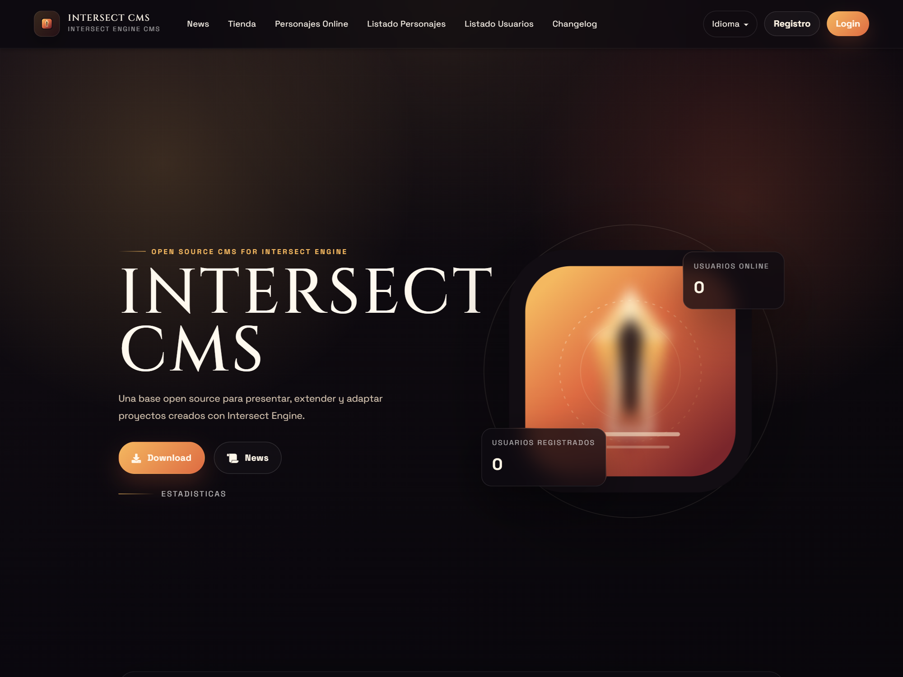
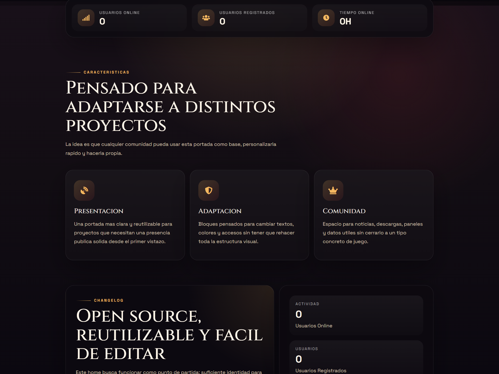
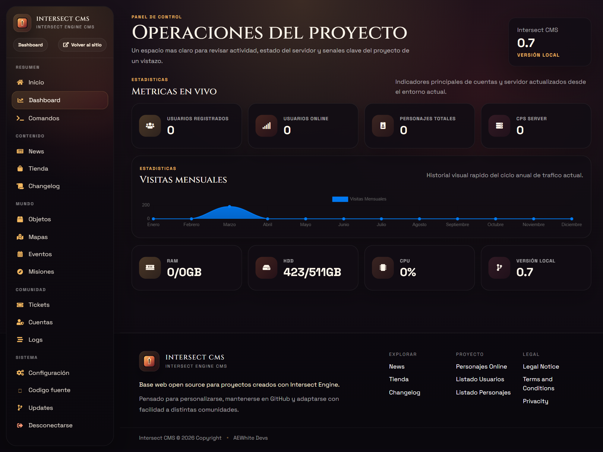

# Intersect CMS

CMS for Intersect Engine [](https://www.codacy.com/gh/WhiteAssassins/Intersect_CMS/dashboard?utm_source=github.com&utm_medium=referral&utm_content=WhiteAssassins/Intersect_CMS&utm_campaign=Badge_Grade) [](https://www.codefactor.io/repository/github/whiteassassins/intersect_cms)

Intersect CMS es una base web open source para proyectos creados con Intersect Engine. Incluye portada publica, autenticacion, panel administrativo, noticias, tienda, soporte basico y una estructura pensada para que cualquier comunidad pueda descargarla, adaptarla y usarla como punto de partida.

## Estado actual

- Rama principal actual: `codeigniter3`
- Framework base: `CodeIgniter 3.1.13`
- Dependencias PHP principales: `guzzlehttp/guzzle` y `phpmailer/phpmailer`
- Estado del proyecto: legado recuperado, actualizado y en proceso de rebranding visual

Este repositorio ya no usa `main_ci4` como base principal. Si en algun momento hubo pruebas de migracion a CodeIgniter 4, hoy la linea real de trabajo es la rama `codeigniter3`.

## Que incluye

- Home publica rebrandizada y pensada como base editable para cualquier juego
- Login, registro, recuperacion y panel de usuario
- Panel administrativo con dashboard, configuracion, noticias, tienda y utilidades
- Integracion con API de Intersect Engine
- Sistema de traducciones para varios idiomas
- Base de datos inicial incluida en `intersec.sql`

## Capturas del proyecto

Capturas actuales de la rama `codeigniter3`.





## Requisitos

- PHP 8.1 o superior
- MariaDB o MySQL
- Composer
- Un servidor de Intersect si quieres usar las secciones conectadas a la API del juego

Notas:

- El CMS puede arrancar en local sin tener la API de Intersect completamente configurada, pero varias pantallas dependen de ella para mostrar datos reales.
- Para desarrollo local se puede usar el servidor embebido de PHP con `router.php`.

## Instalacion local

1. Clona el repositorio y asegurate de estar en la rama correcta:

```bash
git clone https://github.com/WhiteAssassins/Intersect_CMS.git
cd Intersect_CMS
git checkout codeigniter3
```

2. Instala dependencias:

```bash
composer install
```

3. Crea una base de datos e importa el esquema inicial:

```bash
mysql -u root -p intersec < intersec.sql
```

4. Ajusta la conexion en `application/config/database.php`.

Valores por defecto del repo:

- host: `localhost`
- user: `root`
- password: vacio
- database: `intersec`

5. Configura las variables de entorno que necesites.

Puedes partir de `.env.example` y ajustar los valores a tu entorno.

6. Levanta el proyecto en local:

```bash
php -S 127.0.0.1:8080 router.php
```

7. Abre la web en:

```text
http://127.0.0.1:8080/
```

## Variables de entorno utiles

Estas son las variables mas importantes soportadas hoy por la configuracion:

- `CMS_BASE_URL`
- `CMS_FORCE_HTTPS`
- `CMS_ENCRYPTION_KEY`
- `CMS_SESSION_PATH`
- `CMS_CSRF_PROTECTION`
- `CMS_API_IP`
- `CMS_API_USER`
- `CMS_API_PASS`
- `CMS_QVAPAY_ID`
- `CMS_QVAPAY_SECRET`
- `CMS_SUPPORT_EMAIL`
- `CMS_SUPPORT_EMAIL_PASSWORD`

Ejemplo rapido en PowerShell:

```powershell
$env:CMS_BASE_URL="http://127.0.0.1:8080/"
$env:CMS_ENCRYPTION_KEY="change-this-key"
$env:CMS_CSRF_PROTECTION="false"
php -S 127.0.0.1:8080 router.php
```

## Credenciales de desarrollo

Si importas `intersec.sql`, el usuario semilla de desarrollo es:

- usuario: `Admin`
- password: `Admin`

Esto es solo para desarrollo local. Cambialo antes de usar el proyecto en un entorno real.

## Estructura del proyecto

- `application/`: controladores, modelos, vistas, helpers y configuracion de la app
- `system/`: nucleo de CodeIgniter 3
- `public/`: CSS, JS, favicon, imagenes y assets del rebranding
- `vendor/`: dependencias instaladas por Composer
- `intersec.sql`: base de datos inicial
- `router.php`: soporte para ejecutar el proyecto con el servidor embebido de PHP
- `index.php`: punto de entrada principal

Tambien existen carpetas heredadas de intentos anteriores como `app/`, `tests/` y `writable/`, pero la aplicacion activa actual vive en la estructura clasica de CodeIgniter 3.

## Estado del rescate

En esta etapa ya se hicieron varias mejoras importantes sobre la base legacy:

- actualizacion a CodeIgniter 3.1.13
- mejoras de compatibilidad con PHP moderno
- refactor de muchas vistas para sacar logica de base de datos y API
- mejoras de sesion, login y arranque local
- endurecimiento inicial de seguridad y flujo de pagos
- rebranding visual progresivo del home y del panel admin

Queda trabajo por delante, sobre todo en modularizar controladores grandes y seguir afinando formularios, configuracion y UX, pero el proyecto ya esta en un estado mucho mas recuperable y mantenible.

## Desarrollo

Si solo quieres probar el proyecto rapido:

```bash
composer install
php -S 127.0.0.1:8080 router.php
```

Tambien puedes lanzar una comprobacion rapida de rutas y login admin con:

```powershell
powershell -ExecutionPolicy Bypass -File .\scripts\smoke.ps1 -BaseUrl http://127.0.0.1:8082/
```

Si quieres usar toda la funcionalidad:

- importa `intersec.sql`
- configura `application/config/database.php`
- define variables de entorno para API, correo, sesiones y seguridad
- conecta tu servidor de Intersect Engine

## Comunidad

- Discord: <https://discord.gg/2XcYgevUws>
- Twitter: <https://twitter.com/whiteassassinsr/>
- Buy Me a Coffee: <https://www.buymeacoffee.com/whiteassassins>

## Licencia

Consulta [LICENSE](LICENSE).
